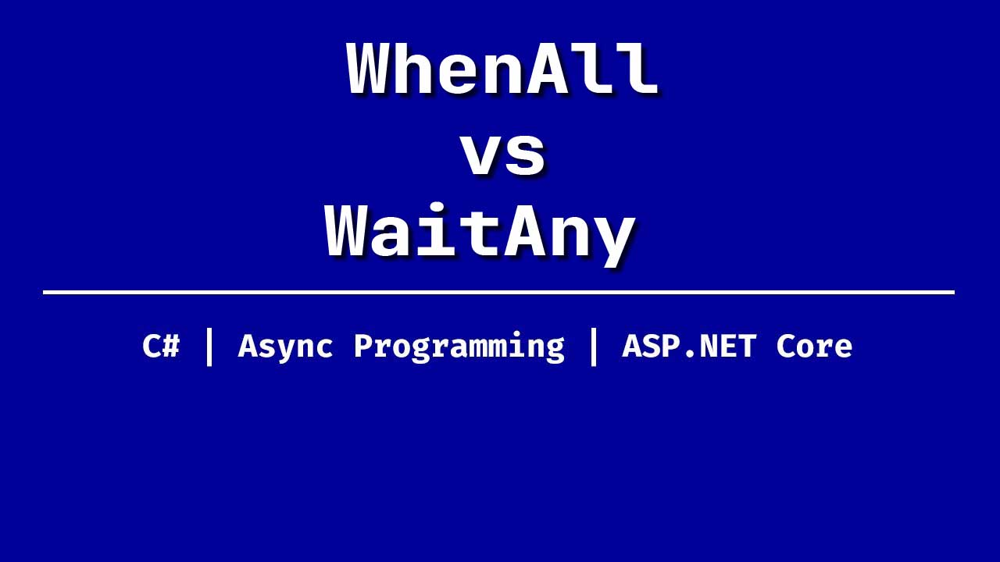

<a id="anchor"></a>
# Почему вместо `Task.WhenAll` стоит использовать `Task.WaitAny`
## Обзор методов `Task.WhenAll` и `Task.WaitAny` в `.NET`

<a href="#anchor" target="_blank"></a>

В мире асинхронного программирования `.NET`, методы работы с задачами (`Task`) играют ключевую роль. Два из самых популярных методов для управления множеством задач — это `Task.WhenAll` и `Task.WaitAny`. Хотя оба метода позволяют работать с несколькими задачами одновременно, их назначение и поведение значительно различаются. В этой статье мы разберем, почему в некоторых случаях использование `Task.WaitAny` предпочтительнее, чем `Task.WhenAll`.

## Что такое `Task.WhenAll?`
Метод `Task.WhenAll` используется для ожидания завершения всех задач, переданных ему в виде коллекции. Он возвращает новую задачу, которая завершается только тогда, когда все задачи внутри коллекции завершены.

```csharp
var task1 = Task.Delay(2000);
var task2 = Task.Delay(5000);

await Task.WhenAll(task1, task2);

Console.WriteLine("Все задачи завершены!");

```

### Преимущества Task.WhenAll
* Простота использования: вы можете дождаться завершения всех задач одним вызовом.
* Подходит для ситуаций, где вам необходимо убедиться, что все операции завершились успешно.

### Недостатки Task.WhenAll
* Если одна из задач выполняется дольше других, вам придется ждать завершения самой медленной задачи.
* В случае ошибки в одной из задач, остальные задачи продолжат выполняться, но результат будет отражать первую возникшую ошибку.

---

## Что такое Task.WaitAny?
Метод Task.WaitAny позволяет дождаться завершения первой завершившейся задачи из коллекции. После этого вы можете решить, что делать дальше: либо продолжить работу с другими задачами, либо завершить выполнение.

```csharp

var task1 = Task.Delay(2000);
var task2 = Task.Delay(5000);

while (true)
{
    var completedTask = await Task.WaitAny(task1, task2);

    if (completedTask == task1)
    {
        Console.WriteLine("Задача 1 завершена!");
    }
    else if (completedTask == task2)
    {
        Console.WriteLine("Задача 2 завершена!");
    }

    // Можно проверить, завершились ли все задачи
    if (task1.IsCompleted && task2.IsCompleted)
        break;
}

```

### Преимущества Task.WaitAny
* Гибкость: вы можете реагировать на каждую завершившуюся задачу по мере её завершения.
* Эффективность: если одна задача завершается быстрее других, вы можете сразу начать обработку её результата, не дожидаясь остальных.

### Недостатки Task.WaitAny
* Требует более сложной логики для управления состоянием задач.
* Может быть менее удобен, если вам действительно нужно дождаться завершения всех задач.

## Когда использовать `Task.WaitAny` вместо `Task.WhenAll`?
### Реакция на первое завершение задачи
Представьте ситуацию, где вы запускаете несколько запросов к API или базе данных, и вас интересует только первый успешный ответ. Использование Task.WhenAll здесь было бы неэффективным, так как вы всё равно ждали бы завершения всех запросов. С Task.WaitAny вы можете получить результат первого завершившегося запроса и немедленно приступить к его обработке.

```csharp

var task1 = FetchDataFromApi1();
var task2 = FetchDataFromApi2();

var firstCompletedTask = await Task.WaitAny(task1, task2);

if (firstCompletedTask == task1)
{
    Console.WriteLine("Данные получены из API 1");
}
else
{
    Console.WriteLine("Данные получены из API 2");
}

```

### Оптимизация производительности
> Если одна из задач завершается значительно быстрее других, использование Task.WhenAll может привести к ненужному ожиданию. С Task.WaitAny вы можете немедленно начать обработку результата первой завершившейся задачи, а остальные задачи можно отменить или игнорировать.

### Обработка ошибок
В случае, если одна из задач завершается с ошибкой, вы можете немедленно принять меры, не дожидаясь завершения остальных задач. Это особенно важно в системах, где важно быстро реагировать на проблемы.

```csharp
try
{
    var completedTask = await Task.WaitAny(task1, task2);

    if (completedTask.IsFaulted)
    {
        Console.WriteLine($"Ошибка в задаче {completedTask.Id}: {completedTask.Exception}");
    }
    else
    {
        Console.WriteLine($"Задача {completedTask.Id} завершена успешно.");
    }
}
catch (Exception ex)
{
    Console.WriteLine($"Общая ошибка: {ex.Message}");
}

```

### Параллельная обработка результатов
Если вам нужно обрабатывать результаты каждой задачи по мере их завершения, Task.WaitAny предоставляет больше контроля над процессом. Вы можете организовать цикл, который будет обрабатывать каждую завершившуюся задачу индивидуально.

---

## Пример сравнения
Допустим, у нас есть две задачи: одна выполняется 2 секунды, другая — 5 секунд.

### Использование `Task.WhenAll`

```csharp

var task1 = Task.Delay(2000);
var task2 = Task.Delay(5000);

await Task.WhenAll(task1, task2);

Console.WriteLine("Все задачи завершены!");

```

* Результат: программа ждёт 5 секунд, пока не завершится самая долгая задача.

### Использование `Task.WaitAny`

```csharp

var task1 = Task.Delay(2000);
var task2 = Task.Delay(5000);

while (!task1.IsCompleted || !task2.IsCompleted)
{
    var completedTask = await Task.WaitAny(task1, task2);

    if (completedTask == task1)
    {
        Console.WriteLine("Задача 1 завершена через 2 секунды!");
    }
    else if (completedTask == task2)
    {
        Console.WriteLine("Задача 2 завершена через 5 секунд!");
    }
}

```

* Результат: программа выводит сообщение о завершении задачи 1 через 2 секунды, а затем ждёт ещё 3 секунды для завершения задачи 2.

---

## Заключение
> Task.WhenAll и Task.WaitAny — это два мощных инструмента для работы с асинхронными задачами, но их выбор зависит от конкретной задачи:
> * Используйте Task.WhenAll, если вам нужно дождаться завершения всех задач.
> * Используйте Task.WaitAny, если вам нужно реагировать на каждую завершившуюся задачу по мере её завершения.
>> В современных приложениях, где важна производительность и гибкость, использование Task.WaitAny часто оказывается предпочтительнее, особенно в случаях, когда требуется быстрая реакция на первые результаты или оптимизация времени выполнения.

<a href="https://github.com/DeNaN20250203?tab=repositories" target="_blank"></a>  

[Верх](#anchor)
